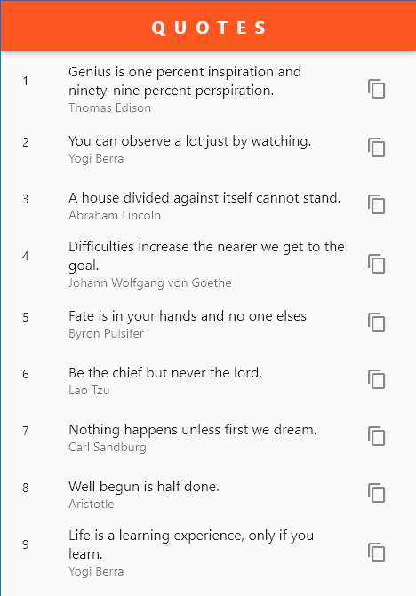
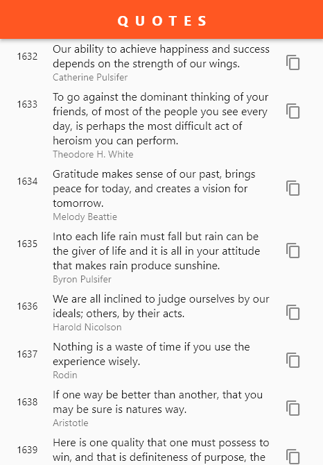

# Quote App

  

## Overview
Quote app is a Flutter app for motivational quotes, and share them with friends to spread positivity.

## Features
- Browse a vast collection of carefully curated quotes.
- Share quotes [copy].

## Screenshots
<!-- Add some screenshots of your app in action -->

  
  

## Getting Started
Follow these steps to run Quote app on your local machine:

1. Clone this repository.
2. Install Flutter and Dart on your development machine.
3. Run `flutter pub get` to install the app's dependencies.
4. Connect a device or start an emulator.
5. Run `flutter run` to launch the app.

## Contributing
Contributions are welcome! If you have any ideas, suggestions, or bug reports, please open an issue or submit a pull request. For major changes, please discuss them first by opening an issue.

## License
This project is licensed under the MIT License. See the [LICENSE](LICENSE) file for details.

## Acknowledgements
- [Quote API](https://type.fit/api/quotes) - The API used to fetch the quotes.

## Contact
If you have any questions or feedback, feel free to reach out:
- Email: crazyuser365@gmail.com
- Linkedin: [@sumansharmatech](https://www.linkedin.com/in/sumansharmatech/)
